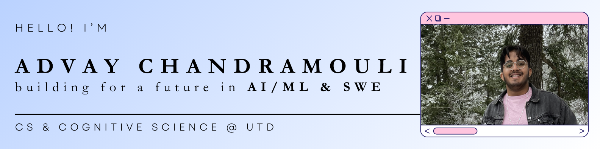

🔭 currently @ Verizon - 5G RF Engineering Co-Op

🌱 learning about **machine learning** + **UI/UX design**  

📄 check out my [resume + past experiences](https://tinyurl.com/advaycmouli-resume)  

⚡ outside of work, i enjoy **traveling**, watching **sports** (🏈🏀🏏), and **exploring nature**!

📫 shoot me a message at: `advaycmouli[at]gmail[dot]com` or connect w/ me below!

 

## 💻 My Tech Stack
### 🧠 Languages & Frameworks

### ☁️ Databases & Cloud Services

### 📚 AI/ML Libraries:

### 🛠️ Other Tools & DevOps

 
 

**
<!-- Proudly created with GPRM ( https://gprm.itsvg.in ) -->
